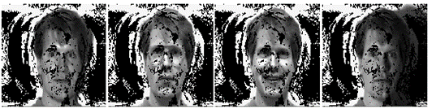

    
  Row Images

    
  One-dimension, remove redundancy 

    
  Two-dimension, remove redundancy

#Abstract 

One of the most important challenges in the preparation and maintenance of databases such as face images is the presence of a large number of variables in the raw data. Reducing the size of each observation so that its features do not disappear and the co-signer uniquely provides dependence on the original data is a necessary requirement of functioning with databases. Principal component analysis and its improved methods are the common techniques for reducing the dimensionality of such datasets and simultaneously increasing interpretability and minimizing information loss. In this paper, our purpose is to define one preprocessing step as nonuniform sampling to preserve raw data appearance and to increase the performance of the dimensional reduction methods. We use the properties of sparse principal component analysis to identify the location of less important values of the raw data that do not interfere with data features. By using sparse eigenvectors, two algorithms are presented to remove redundancy from the raw data in the one-dimensional and two-dimensional cases. After removing raw data redundancy, newly obtained data in other applications such as database recognition and compression can be used. Simulation results show that using this preprocessing step reduces the memory amount and also provides a higher recognition rate.
